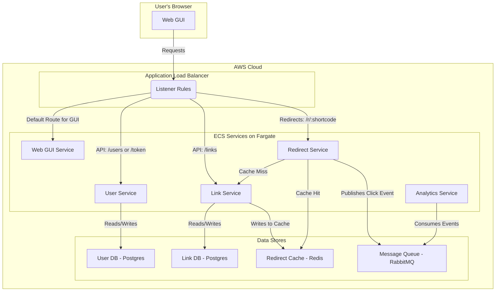

# LinkShrink: A Complete Microservices-Powered URL Shortener

LinkShrink is a fully-featured URL shortening application built on a modern microservices architecture. It provides user authentication, authenticated link creation and management, high-performance redirects, and asynchronous click analytics. The entire system is designed for automated deployment to AWS using Terraform and GitHub Actions.

This repository serves as a complete, production-ready blueprint for deploying a complex, multi-service application to the cloud.

## Table of Contents

1.  [Project Overview](#project-overview)
2.  [System Architecture](#system-architecture)
3.  [File & Directory Structure](#file--directory-structure)
4.  [Getting Started: Local Development](#getting-started-local-development)
5.  [Cloud Deployment: The Automated CI/CD Pipeline](#cloud-deployment-the-automated-cicd-pipeline)
    -   [Step 1: Prerequisites](#step-1-prerequisites)
    -   [Step 2: GitHub Repository Secrets Setup](#step-2-github-repository-secrets-setup)
    -   [Step 3: The Automated Deployment](#step-3-the-automated-deployment)
6.  [Running Terraform Commands Locally](#running-terraform-commands-locally)
7.  [Destroying the Cloud Infrastructure](#destroying-the-cloud-infrastructure)
8.  [Key Design Decisions & Concepts](#key-design-decisions--concepts)
9.  [Future Improvements](#future-improvements)

## Project Overview

This project demonstrates a real-world software development lifecycle, from local containerized development to a fully automated cloud deployment.

**Core Features:**
-   **User-Facing GUI:** A simple web interface for user registration, login, and link management.
-   **Authenticated API:** Users must be logged in to create or view their links.
-   **High-Performance Redirects:** A dedicated redirect service using a Redis cache for sub-millisecond lookups.
-   **Asynchronous Analytics:** Link clicks are processed in the background via a message queue (RabbitMQ) without slowing down the user redirect.
-   **Infrastructure as Code (IaC):** The entire AWS infrastructure is defined and managed by Terraform.
-   **Automated CI/CD:** A multi-stage GitHub Actions workflow automatically builds, tests (implicitly), and deploys the entire application on every push to the `main` branch.

## System Architecture

The system is composed of five distinct microservices and a suite of managed AWS services, all orchestrated by an Application Load Balancer.



## File & Directory Structure

-   **Core Application Services:** Source code for each microservice (`user-service/`, `link-service/`, etc.).
-   **Local Development & Tooling:** Files used exclusively for local development (`docker-compose.yml`, `gateway/nginx.conf`).
-   **Cloud Infrastructure & CI/CD (AWS):** Files defining the production environment and its automation (`.github/`, `terraform/`).
-   **Project-Wide Configuration:** General project files (`.gitignore`, `.dockerignore`, `README.md`).

## Getting Started: Local Development

Running the entire application on your local machine is the recommended way to develop new features.

**Prerequisites:**
-   Docker & Docker Compose

**Steps:**
1.  Clone this repository.
2.  From the project's root directory, run:
    ```bash
    docker-compose up --build
    ```
3.  Open your web browser and navigate to `http://localhost:8080`.

## Cloud Deployment: The Automated CI/CD Pipeline

This project is configured for fully automated deployment to AWS. Every `git push` to the `main` branch triggers a safe, multi-stage deployment.

### Step 1: Prerequisites

1.  **AWS Account:** You need an AWS account.
2.  **AWS CLI:** Install and configure the AWS CLI on your local machine (`aws configure`).
3.  **Terraform:** Install Terraform.
4.  **S3 Backend:** You must manually create an S3 bucket and a DynamoDB table for the Terraform backend as defined in `terraform/backend.tf` before the first deployment.

### Step 2: GitHub Repository Secrets Setup

The workflow requires access to sensitive information. Store these as encrypted secrets in your repository's **Settings > Secrets and variables > Actions**.

| Secret Name                   | Description                                  |
| ----------------------------- | -------------------------------------------- |
| `AWS_ACCESS_KEY_ID`           | Your IAM user's Access Key ID.               |
| `AWS_SECRET_ACCESS_KEY`       | Your IAM user's Secret Access Key.           |
| `TF_VAR_DB_PASSWORD`          | A strong password for the `user-db`.         |
| `TF_VAR_LINK_DB_PASSWORD`     | A strong password for the `link-db`.         |
| `TF_VAR_JWT_SECRET_KEY`       | A long, random string for signing JWTs.      |
| `TF_VAR_MQ_PASSWORD`          | A strong password for the RabbitMQ user.     |

### Step 3: The Automated Deployment

With secrets configured, the process is fully automated.

1.  **Make a code change**.
2.  **Commit and push** that change to the `main` branch: `git push origin main`.

Pushing to `main` automatically triggers the workflow. Monitor its progress in the "Actions" tab of your repository.

## Running Terraform Commands Locally

If you need to run `terraform` commands (like `plan`, `apply`, or `destroy`) from your own computer instead of using the GitHub Actions workflow, you must provide your secrets locally.

1.  Navigate to the `/terraform` directory.
2.  Copy the example variables file:
    ```bash
    cp terraform.tfvars.example terraform.tfvars
    ```
3.  Open the new `terraform.tfvars` file and replace the placeholder values with your actual secrets.
4.  **Do not commit `terraform.tfvars` to Git.** The `.gitignore` file is configured to prevent this.
5.  You can now run commands like `terraform plan` or `terraform apply` locally.

## Destroying the Cloud Infrastructure

To avoid ongoing AWS costs, you can tear down the entire infrastructure with a single command from the `/terraform` directory:

```bash
terraform destroy
```

## Key Design Decisions & Concepts

-   **Three-Phase Deployment:** The CI/CD pipeline is explicitly split into three jobs (Create Repos, Build Images, Deploy Services) to correctly handle infrastructure dependencies.
-   **Immutable Image Tags:** ECR repositories are configured to be immutable, ensuring deployment integrity.
-   **Git Commit as Source of Truth:** The Git commit hash is used as the Docker image tag, creating a direct, auditable link between code and what's running in production.

## Future Improvements

-   **Add HTTPS:** Implement an ACM certificate and update the ALB listener to use HTTPS for secure traffic.
-   **Custom Domain:** Add Route 53 configuration to point a custom domain to the Application Load Balancer.
-   **Unit & Integration Tests:** Add a testing stage to the CI/CD pipeline before deployment.
-   **Staging Environment:** Duplicate the Terraform setup to create a separate "staging" environment.