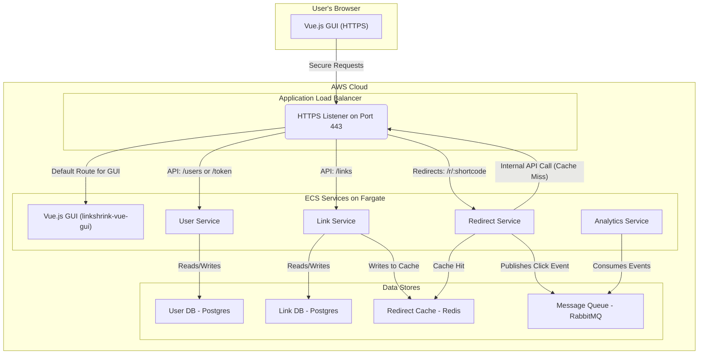

# LinkShrink Microservices

A fully-featured URL shortening application built on a modern microservices architecture. It provides user authentication, authenticated link creation and management, high-performance redirects, and asynchronous click analytics. The entire system is designed for automated, production-ready deployment to AWS using Terraform and GitHub Actions.

This repository serves as a complete, real-world blueprint for deploying a complex, multi-service application to the cloud.

## Table of Contents

1.  [Project Overview](#project-overview)
2.  [System Architecture](#system-architecture)
3.  [File & Directory Structure](#file--directory-structure)
4.  [Getting Started: Local Development](#getting-started-local-development)
5.  [Cloud Deployment: The Automated CI/CD Pipeline](#cloud-deployment-the-automated-cicd-pipeline)
    -   [One-Time Setup (Prerequisites)](#one-time-setup-prerequisites)
    -   [Automated Deployment](#automated-deployment)
6.  [Running Terraform Commands Locally](#running-terraform-commands-locally)
7.  [Destroying the Cloud Infrastructure](#destroying-the-cloud-infrastructure)
8.  [Key Design Decisions & Concepts](#key-design-decisions--concepts)
9.  [Release History](#release-history)

## Project Overview

This project demonstrates a real-world software development lifecycle, from local containerized development to a fully automated cloud deployment.

**Core Features:**
-   **Secure HTTPS:** All traffic is encrypted using an SSL certificate from AWS Certificate Manager.
-   **Custom Domain:** The application is served from a custom domain/subdomain managed by Amazon Route 53.
-   **User-Facing GUI:** A reactive frontend built with Vue.js for user registration, login, and link management.
-   **Authenticated API:** Users must be logged in to create or view their links.
-   **Custom Aliases:** Users can now specify their own custom short codes for links.
-   **High-Performance Redirects:** A dedicated redirect service using a Redis cache for sub-millisecond lookups.
-   **Asynchronous Analytics:** Link clicks are processed in the background via a message queue (RabbitMQ) without slowing down user redirects.
-   **Infrastructure as Code (IaC):** The entire AWS infrastructure is defined idempotently and managed by Terraform.
-   **Automated CI/CD:** A multi-stage GitHub Actions workflow automatically builds, tests (implicitly), and deploys the entire application on every push to the `main` branch.

## System Architecture

The system is composed of five distinct microservices and a suite of managed AWS services, all orchestrated by an Application Load Balancer. All public traffic is served over HTTPS.



## File & Directory Structure

-   **Core Application Services:** Source code for each microservice (`user-service/`, `link-service/`, etc.) and the new Vue.js frontend (`linkshrink-vue-gui/`).
-   **Local Development & Tooling:** The file used for orchestrating all services locally (`docker-compose.yml`).
-   **Cloud Infrastructure & CI/CD (AWS):** Files defining the production environment and its automation (`.github/`, `terraform/`).
-   **Project-Wide Configuration:** General project files (`.gitignore`, `.dockerignore`, `README.md`).

## Getting Started: Local Development

Running the entire application on your local machine is the recommended way to develop new features. The setup uses Docker Compose to orchestrate all services, including the Vue.js development server with hot-reloading.

**Prerequisites:**
-   Docker & Docker Compose

**Steps:**
1.  Clone this repository.
2.  From the project's root directory, run:
    ```bash
    docker-compose up --build
    ```
3.  Open your web browser and navigate to `http://localhost:8080`. You will see the Vue.js application.

## Cloud Deployment: The Automated CI/CD Pipeline

This project is configured for fully automated deployment to AWS. The process requires a one-time setup of cloud resources and secrets, after which every `git push` to the `main` branch will trigger a safe, multi-stage deployment.

### One-Time Setup (Prerequisites)

1.  **AWS Account:** You need an active AWS account.
2.  **Custom Domain & DNS Delegation:**
    -   Own a custom domain name (e.g., `c3mcal.com`).
    -   In Amazon Route 53, create a public **Hosted Zone** for a subdomain you will use for AWS projects (e.g., `aws.c3mcal.com`).
    -   In your domain registrar's settings (e.g., Cloudflare, GoDaddy), add `NS` records to delegate control of that subdomain to the four Name Servers provided by your new Route 53 Hosted Zone.
3.  **SSL Certificate:**
    -   In AWS Certificate Manager (ACM), request a public certificate for your application's domain (e.g., `linkshrink.aws.c3mcal.com`) and a wildcard (e.g., `*.aws.c3mcal.com`).
    -   Use **DNS validation**. Since Route 53 now controls your DNS, you can use the "Create records in Route 53" button for instant, automatic validation.
    -   Once the certificate is "Issued", copy its **ARN**.
4.  **Terraform Backend:** Manually create an S3 bucket and a DynamoDB table in AWS to store Terraform's state securely, as defined in `terraform/backend.tf`.
5.  **GitHub Repository Secrets:** In your repository's **Settings > Secrets and variables > Actions**, create the following secrets. The workflow uses these to authenticate and configure the deployment.

| Secret Name                   | Description                                                |
| ----------------------------- | ---------------------------------------------------------- |
| `AWS_ACCESS_KEY_ID`           | Your IAM user's Access Key ID.                             |
| `AWS_SECRET_ACCESS_KEY`       | Your IAM user's Secret Access Key.                         |
| `TF_VAR_DB_PASSWORD`          | A strong password for the `user-db`.                       |
| `TF_VAR_LINK_DB_PASSWORD`     | A strong password for the `link-db`.                       |
| `TF_VAR_JWT_SECRET_KEY`       | A long, random string for signing JWTs.                    |
| `TF_VAR_MQ_PASSWORD`          | A strong password for the RabbitMQ user.                   |
| `TF_VAR_PARENT_ZONE_NAME`     | The name of your delegated Route 53 Hosted Zone (e.g., `aws.c3mcal.com`). |
| `TF_VAR_DOMAIN_NAME`          | The full domain for this specific application (e.g., `linkshrink.aws.c3mcal.com`). |
| `TF_VAR_ACM_CERTIFICATE_ARN`  | The full ARN of your issued ACM certificate.               |

*Note: The `TF_VAR_` prefix is important, as it allows Terraform to automatically recognize these as input variables.*

### Automated Deployment

With the one-time setup complete, the process is fully automated.

1.  **Develop on a branch:** Create a new branch for your changes (`git checkout -b fix/new-feature`).
2.  **Open a Pull Request:** When ready, push your branch and open a Pull Request against `main`. The CI workflow will run a `terraform plan` to show you a safe preview of the infrastructure changes.
3.  **Merge to `main`:** After reviewing the plan, merge the PR. Merging to `main` automatically triggers the full deployment workflow.

Monitor the progress in the "Actions" tab of your repository. Upon completion, your application will be live at your custom domain.

## Running Terraform Commands Locally

To run `terraform` commands from your own computer, you must provide your secrets locally.

1.  Navigate to the `/terraform` directory.
2.  Copy the example variables file: `cp terraform.tfvars.example terraform.tfvars`
3.  Open `terraform.tfvars` and replace the placeholders with your actual secrets. This file is ignored by Git and must not be committed.
4.  You can now run commands like `terraform plan` or `terraform apply` locally.

## Destroying the Cloud Infrastructure

To avoid ongoing AWS costs, you can tear down the entire infrastructure with a single command from the `/terraform` directory:

```bash
terraform destroy
```

## Key Design Decisions & Concepts

-   **Three-Phase Deployment:** The CI/CD pipeline is explicitly split into three jobs (Create Repos, Build Images, Deploy Services) to correctly handle infrastructure dependencies.
-   **Immutable Image Tags:** ECR repositories are configured to be immutable, ensuring deployment integrity and preventing accidental changes.
-   **Git Commit as Source of Truth:** The Git commit hash is used as the Docker image tag, creating a direct, auditable link between code and what's running in production.

## Release History

-   **v2.0.0-beta.1 - The Vue.js Frontend (Current)**
    -   Overhauled the entire frontend with a modern Vue.js single-page application (`linkshrink-vue-gui`).
    -   Introduced the ability for users to create links with custom short codes (aliases).
    -   Replaced the static Nginx-based local UI with a full-featured Vue development server for a better developer experience.
    -   Updated the CI/CD pipeline to seamlessly build and deploy the new Vue.js frontend alongside the backend services.
    -   Resolved complex Terraform state-locking and resource dependency issues during the migration, hardening the deployment process for future updates.

-   **v1.1.0 - The Secure Cloud Update**
    -   Added full HTTPS encryption for all traffic using AWS Certificate Manager.
    -   Configured the application to run on a custom subdomain (`linkshrink.aws.c3mcal.com`).
    -   Implemented automated DNS record creation via Terraform and Route 53.
    -   Hardened the CI/CD pipeline to be fully parameterized and reusable.
    -   Fixed a bug where the `analytics-service` would fail to start.
    -   Fixed a bug where the `redirect-service` could not handle the `/r/` path.
    -   Fixed a bug where the `link-service` generated incorrect `localhost` URLs.

-   **v1.0.0 - Initial Stable Release**
    -   First stable, fully functional release of the LinkShrink application.
    -   Established the core 5-service microservices architecture.
    -   Launched the initial automated deployment pipeline to AWS with a functional frontend.